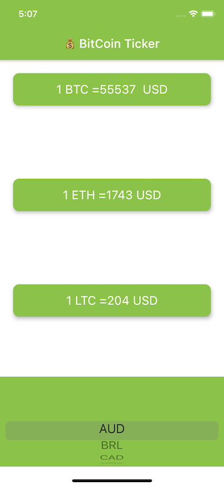

# bitcoin_ticker_app

Coins Ticker Flutter application d 

## Specs of the Coins Ticker App

This project is done as a challenge part of the Complete Flutter Course by Angela. 

A few notes about this Flutter project:

- Its using http request from this package(  http: ^0.13.0 ) to get data from this API (https://rest.coinapi.io)
- It uses DropdownButton Widget from Material design.
- It used Cupertino Widgets in your app.
- It checks the platform that your app is being run on to customise the UI for that platform.

